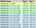
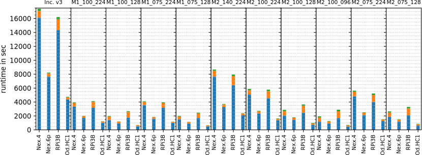

# tf-transferlearning-benchmarks

## Introduction
This Git repository contains additional content to reproduce the measurements of our paper "Enabling Privacy with Transfer Learning for Image Classification DNNs on Mobile Devices". Please consider citing the paper if you use any code or content of this repository:

```
@inproceedings{seiderer2018enabling,
  title={Enabling Privacy with Transfer Learning for Image Classification DNNs on Mobile Devices},
  author={Seiderer, Andreas and Dietz, Michael and Aslan, Ilhan and Andr{\'e}, Elisabeth},
  booktitle={International Conference on Smart Objects and Technologies for Social Good},
  series = {Goodtechs '18},
  location = {Bologna, Italy},
  year={2018},
  acmid = {3284893},
  doi = {10.1145/3284869.3284893},
  isbn = {978-1-4503-6581-9/18/11},
  publisher = {ACM}
}
```

The scripts used for retraining are based on the "retrain.py" python script used in the official TensorFlow tutorial:
* [Tutorial](https://www.tensorflow.org/hub/tutorials/image_retraining)
* [Repository](https://github.com/tensorflow/hub)


## Devices
Our experiments were conducted on following devices on which a CHROOT environment with Tensorflow 1.7.0 for ARM was deployed.

### Nexus 4
* SoC: Qualcomm Snapdragon S4 Pro APQ8064
* CPU: 1.5 GHz quad-core Krait
* RAM: 2 GB, LPDDR2
* Data storage type: NAND
* Host-OS: LineageOS 14.1
* CHROOT: Debian Stretch armhf

### Nexus 6p
* SoC: Qualcomm Snapdragon 810 v2.1
* CPU: 2.0 GHz octa core (4x1.55 GHz Cortex-A53 & 4x2.0 GHz Cortex-A57) 64-bit ARMv8-A
* RAM: 3 GB, LPDDR4
* Data storage type: NAND
* Host-OS: LineageOS 15.1
* CHROOT: Debian Stretch armhf

### Raspberry Pi 3 B
* SoC: Broadcom BCM2837
* CPU: 1.2 GHz 64-bit quad-core ARM Cortex-A53
* RAM: 1 GB, LPDDR2
* Data storage type: SD card
* OS: Raspbian Stretch

### Odroid HC 1
* SoC: Samsung Exynos5422
* CPU: 4xCortex-A15 2Ghz and 4xCortex-A7 Octa core
* RAM: 2 GB, LPDDR3
* Data storage type: SD card (OS) + SSD (Docker container)
* Host-OS: Ubuntu Server 16.04
* CHROOT: Debian Stretch armhf

## Models
For the performance tests on the devices the following models were used:


The accuracies for the ILSVRC-2012-CLS data set were extracted from the following websites where also details can be found:

* [Mobilenet v1](https://github.com/tensorflow/models/blob/master/research/slim/nets/mobilenet_v1.md)
* [Mobilenet v2](https://github.com/tensorflow/models/tree/master/research/slim/nets/mobilenet)
* [Mobilenets and others](https://github.com/tensorflow/models/blob/master/research/slim/README.md)

## Dataset
The following free available data set (flowers) was used for all tests:
http://download.tensorflow.org/example_images/flower_photos.tgz

## Results

Average device runtimes for bottleneck creation (blue), training (orange) and evaluation (green) out of three runs for each model configuration for the flower data set. An overview with the exact values can be found in this PDF file:
[LINK](measurements/Measurements_Overview.pdf)


")
Macro-average precisions and recalls of models trained with an incremented count of flower pictures (80% training and 20% validation). The evaluation set consists out of 400 pictures for each class. All trainings and model evaluations were conducted three times and the macro-averages of precisions and recalls are averaged. Used base model: M2_100_128.

")
Macro-average precisions and recalls of models trained with an incremented count of daisy flower pictures while four other flower classes are kept with constant picture count of 150 (80% training and 20% validation). The evaluation set consists out of 400 pictures for each class. All trainings and model evaluations were conducted three times and the macro-averages of precisions and recalls are averaged. Used base model: M2_100_128.

")
Macro-average precisions and recalls of models trained with an incremented count of flower pictures (80% training and 20% validation). The count of classes is shown in gray. New pictures are added to a randomly selected class until all classes consist out of 150 pictures. The evaluation set consists out of 400 pictures for each class. All trainings and model evaluations were conducted three times (stable random class selection) and the macro-averages of precisions and recalls are averaged. Used base model: M2_100_128.


## Python wheel for ARMv7
The following wheel was used for all experiments on ARM devices:
[LINK](wheels/ARM/tensorflow-1.7.0-cp34-none-any.whl)


## Python scripts
The following python scripts were used to conduct the experiments.

### adapt_file_list_fixed_testing.py
Used to generate file lists for the experiments with incremental file counts. The test set file count is fixed. Requires "lists/flower_photos_list_default.tsv" which can be generated with "retrain_hub_filelist_create.py".
The different lists can be created by enabling / disabling parts of the code with "if True:" or "if False:".

### log_file_analysis.py
Outputs the runtimes and test accuracy by using the log files located in "measurements".

### retrain_hub.py
Adapted retrain_hub.py script from https://github.com/tensorflow/hub with log file output with operations and timestamps. CUDA is switched off.
* Parameters like with original script but "log_file_name" is added to select a name for the log file.

#### Example call:
```
python3 retrain_hub.py --image_dir flower_photos --how_many_training_steps 1000 --log_file_name flower_inceptionv3_1000steps.txt --output_graph flower_inceptionv3.pb --intermediate_output_graphs_dir intermediate_graph/flower_inceptionv3 --output_labels flower_inceptionv3_output_labels.txt --summaries_dir retrain_logs/flower_inceptionv3 --bottleneck_dir bottleneck_flower --saved_model_dir saved_model/flower_inceptionv3
```

#### Example data:
measurements/tf1.7_retrain/flower/nexus6p/1/flower_inceptionv3_1000steps.txt

### retrain_hub_filelist_create.py
Create file list from data directory to allow fixed training, validation and testing splits.
* Parameter 0: data directory
* Parameter 1: output file name
* Parameter 2: testing percentage
* Parameter 3: validation percentage

#### Example call:
```
python3 retrain_hub_filelist_create.py flower_photos flower_photos_list_default.tsv 10 10
```

### retrain_hub_filelists.py
Adapted retrain_hub.py script from https://github.com/tensorflow/hub with log file output with operations and timestamps and file list input. CUDA is switched off.
A file list defines for each file whether it should be used in the training, validation or test set. The lists can be created with "retrain_hub_filelist_create.py", "adapt_file_list.py" and "adapt_file_list_fixed_testing.py".
* Parameters like with original script but "log_file_name" is added to select a name for the log file and "image_list" is added to allow to read a file list instead of a directory.

#### Example call:
```
python3 retrain_hub_filelists.py --image_list lists/generated/all_increment/all_increment_100.tsv --how_many_training_steps 1000 --log_file_name mobilenet_v2_100_128_all_increment_100_1000.txt --tfhub_module https://tfhub.dev/google/imagenet/mobilenet_v2_100_128/feature_vector/1 --output_graph mobilenet_v2_100_128_all_increment_100_1000.pb --intermediate_output_graphs_dir intermediate_graph/mobilenet_v2_100_128_all_increment_100_1000 --output_labels mobilenet_v2_100_128_all_increment_100_1000_output_labels.txt --summaries_dir retrain_logs/mobilenet_v2_100_128_all_increment_100_1000 --bottleneck_dir bottleneck_flower --saved_model_dir saved_model/mobilenet_v2_100_128_all_increment_100_1000
```
### script_generator.py
Created the bash scripts for the different experiments. The different scripts can be created by enabling / disabling parts of the code with "if True:" or "if False:".

## Bash scripts
The following bash scripts were used to conduct the experiments.

### run.sh
Run "retrain_hub.py" with all selected models.

### run_lists_all_increment.sh
Run "retrain_hub_filelists.py" with generated file lists where all picture counts of all classes were incremented after each iteration.

### run_lists_daisy_increment.sh
Run "retrain_hub_filelists.py" with generated file lists where the picture count of the class "daisy" was incremented after each iteration.

### run_lists_random_increment0.sh
Run "retrain_hub_filelists.py" with generated file lists where the picture count of a random class (now fixed by the generated file list) was incremented after each iteration.

### run_lists_random_increment1.sh
Run "retrain_hub_filelists.py" with generated file lists where the picture count of a random class (now fixed by the generated file list) was incremented after each iteration.

### run_lists_random_increment2.sh
Run "retrain_hub_filelists.py" with generated file lists where the picture count of a random class (now fixed by the generated file list) was incremented after each iteration.
